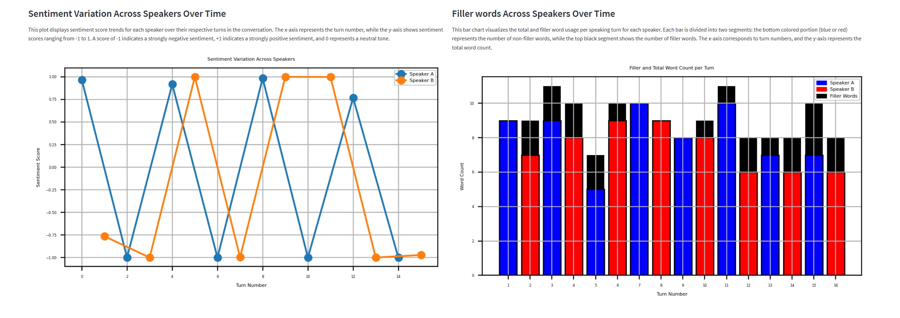

# Sentiment-Analysis
This Streamlit application allows you to upload transcripts, display sentiment scores and filler ratios per turn, compute overall averages, and visualize trends in sentiment and filler word usage over time. 

# ----Features---- #
- Sentiment classification using HuggingFace Transformers
- Filler word detection using spaCy
- Visualizations of speaker sentiment and filler usage for individual speakers

# ---- Requirements---- #

- Python (Recommended Version: 3.10 or 3.11)
- streamlit (Recommended Version: >= 1.0.0)
- pandas
- matplotlib (Recommended Version: >= 3.5)
- spaCy (Recommended Version: >= 3.0)
- transformers (Recommended Version: >= 4.0.0)
- torch
- numpy (Recommended Version: >=1.21,<2.0)

# ---- How to install---- #
- Open your IDE and get the copy of the code from the repo.
- Install the requires packages that are listed under Requirements section
    - pip install streamlit
    - pip install matplotlib
    - pip install spacy
    - python -m spacy download en_core_web_sm    
- Run the application using the following command in the Terminal
    - streamlit run app.py

# ---- In the app---- #
- Upload a transcript by clicking the upload button or drag and drop the file
- Click on "generate the report button" to load the report
- Descriptions of each metrices are as follows:
    - Overall Sentiment Score: This metric quantifies this tone on a scale from -1 (very negative) to 1 (very positive), with values near 0 indicating neutrality.                      
    - Overall Filler Ratio: This metric measures speaking fluency by calculating the proportion of filler words (like "um", "uh", "you know") to the total words in the transcript. A higher ratio suggests less fluent or more hesitant speech

- In one extra hour, I added the visualization plots for Sentiment Variation Across Speakers Over Time and Filler Words Across Speakers Over Time as shown below

  
